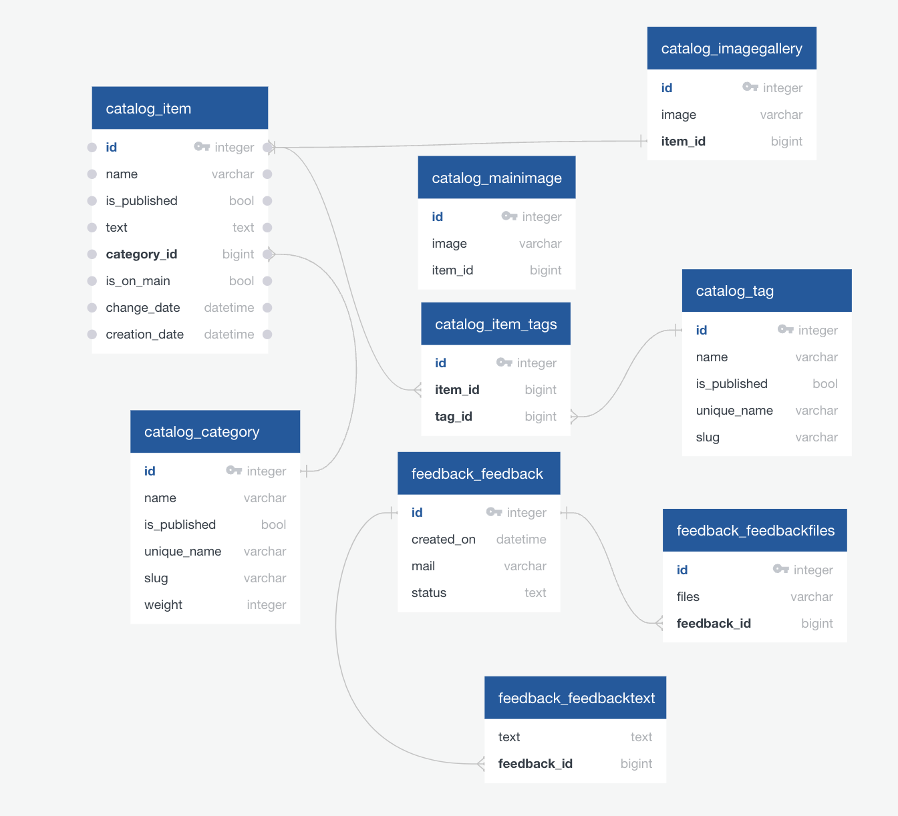

# lyceum_django_education_project


## Запуск проекта
- клонируйте проект с GitHub с помощью команды:
```
git clone https://github.com/Arseniks/lyceum_django_education_project
``` 
- Скопируйте файл .env.template в .env, при необходимости отредактируйте 
  значения переменных:
```
cp .env.template .env
``` 
### На Windows
- Установите и активируйте виртуальное окружение с помощью команд:
```
python -m venv venv
``` 
```
venv\Scripts\activate.bat
``` 
- Установите необходимые вам зависимости
Для основных зависимостей из файла requirements.txt:
```
pip install -r requirements.txt
``` 
- Для разработки нужно также установить зависимости из файла requirements_dev.
txt:
```
pip install -r requirements_dev.txt
``` 
- А для тестирования нужно установить зависимости из файла requirements_test.
  txt:
```
pip install -r requirements_test.txt
```
В папке с файлом manage.py выполните команды:
- Установки миграций БД:
```
python manage.py migrate
```
- Заполнения БД данными из фикстуры:
```
python manage.py loaddata data.json
```
- Установить DEBUG = False
- Закомментировать в settings.py
```
STATICFILES_DIRS = [
    BASE_DIR / 'static_dev',
]
```
- Добавить в settings.py
```
STATIC_DIR = os.path.join(BASE_DIR, 'static')
```
- Сохранение статики:
```
python manage.py collectstatic
```
- Раскомментировать в settings.py
```
STATICFILES_DIRS = [
    BASE_DIR / 'static_dev',
]
```
- Убрать из settings.py
```
STATIC_DIR = os.path.join(BASE_DIR, 'static')
```
- Запуска проекта:
```
python manage.py runserver
```
### На Linux/MAC
- Установите и активируйте виртуальное окружение с помощью команд:
```
python3 -m venv venv
``` 
```
source venv/bin/activate
``` 
- Установите необходимые вам зависимости
Для основных зависимостей из файла requirements.txt:
```
pip3 install -r requirements.txt
``` 
Для разработки нужно также установить зависимости из файла requirements_dev.txt:
```
pip3 install -r requirements_dev.txt
``` 
А для тестирования нужно установить зависимости из файла requirements_test.txt:
```
pip3 install -r requirements_test.txt
```
В папке с файлом manage.py выполните команды:
- Установки миграций БД:
```
python3 manage.py migrate
```
- Заполнения БД данными из фикстуры:
```
python3 manage.py loaddata data.json
```
- Установить DEBUG = False
- Закомментировать в settings.py
```
STATICFILES_DIRS = [
    BASE_DIR / 'static_dev',
]
```
- Добавить в settings.py
```
STATIC_DIR = os.path.join(BASE_DIR, 'static')
```
- Сохранение статики:
```
python3 manage.py collectstatic
```
- Раскомментировать в settings.py
```
STATICFILES_DIRS = [
    BASE_DIR / 'static_dev',
]
```
- Убрать из settings.py
```
STATIC_DIR = os.path.join(BASE_DIR, 'static')
```
- Запуска проекта:
```
python3 manage.py runserver
```


## ER-диаграмма базы данных

