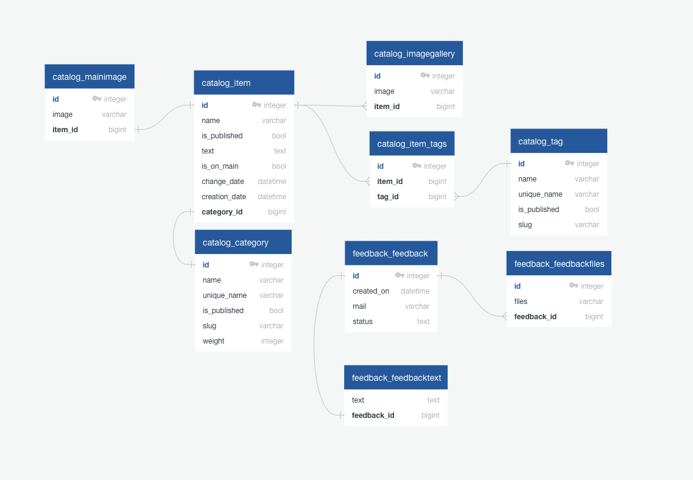
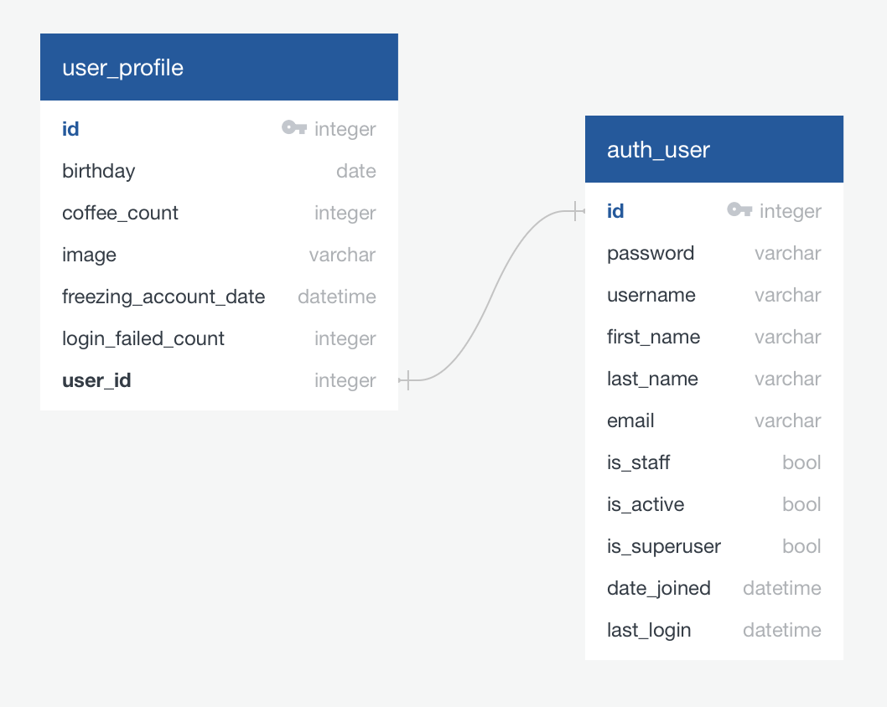

# Проект интернет-магазина для Интенсивов Яндекс


# Запуск проекта
#### Вариант 1:
- Вы можете запустить проект с помощью shell-скрипта:
```
sh project_setup.sh GIT_BRANCH=main
``` 
#### Вариант 2:
- Клонируйте проект с GitHub с помощью команды:
```
git clone https://github.com/Arseniks/lyceum_django_education_project
``` 
- Скопируйте файл .env.template в .env, при необходимости отредактируйте 
  значения переменных:
```
cp .env.template .env
``` 
### На Windows
- Установите и активируйте виртуальное окружение с помощью команд:
```
python -m venv venv
``` 
```
venv\Scripts\activate.bat
``` 
- Установите необходимые вам зависимости
Для основных зависимостей из файла requirements.txt:
```
pip install -r requirements.txt
``` 
- Для разработки нужно также установить зависимости из файла requirements_dev.
txt:
```
pip install -r requirements_dev.txt
``` 
- А для тестирования нужно установить зависимости из файла requirements_test.
  txt:
```
pip install -r requirements_test.txt
```
В папке с файлом manage.py выполните команды:
- Установки миграций БД:
```
python manage.py migrate
```
- Заполнения БД данными из фикстуры:
```
python manage.py loaddata data.json
```
- Сохранение статики:
```
python manage.py collectstatic
```
- Создание бинарных файлов перевода
```
python manage.py compilemessages
```
- Запуска проекта:
```
python manage.py runserver
```
### На Linux/MAC
- Установите и активируйте виртуальное окружение с помощью команд:
```
python3 -m venv venv
``` 
```
source venv/bin/activate
``` 
- Установите необходимые вам зависимости
Для основных зависимостей из файла requirements.txt:
```
pip3 install -r requirements.txt
``` 
- Для разработки нужно также установить зависимости из файла requirements_dev.txt:
```
pip3 install -r requirements_dev.txt
``` 
- А для тестирования нужно установить зависимости из файла requirements_test.txt:
```
pip3 install -r requirements_test.txt
```
В папке с файлом manage.py выполните команды:
- Установки миграций БД:
```
python3 manage.py migrate
```
- Заполнения БД данными из фикстуры:
```
python3 manage.py loaddata data.json
```
- Сохранение статики:
```
python3 manage.py collectstatic
```
- Создание бинарных файлов перевода
```
python3 manage.py compilemessages
```
- Запуска проекта:
```
python3 manage.py runserver
```


## ER-диаграмма базы данных


